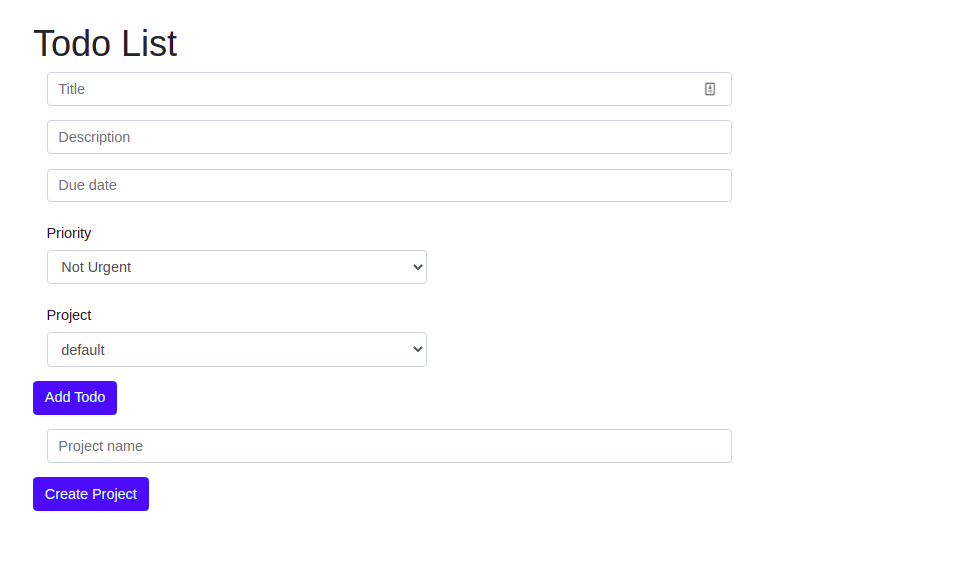

# Todo-list

## About the Project
This is a todo-list project where a user can create a todo and organize them into projects

### The project has the following features:
* An option to create a new todo.
* An option to update a todo.
* An option to delete a todo.
* An option to create a project.
* An option to categorize todos into projects.

## Table of Contents

* [About the Project](#about-the-project)
* [Built With](#built-with)
* [Live Demo](#live-demo)
* [Authors](#authors)
* [Contributing](#contributing)
* [Show your support](#show-your-support)
* [License](#license)
* [Acknowledgements](#acknowledgements)

## Built With

* [JavaScript](https://en.wikipedia.org/wiki/JavaScript)
* [HTML5](https://en.wikipedia.org/wiki/HTML5)

## Live Demo

[Live Demo Link](https://www.binyamhailemeskel.me/TodoList/)

## Authors

👤 **Sayyod Saidov**

- Email: ssayyod@gmail.com
- Github: [@MrSayyod](https://github.com/MrSayyod) 
- LinkedIn:  [Sayyod Saidov](https://www.linkedin.com/in/sayyod-saidov-507b0818b)
- Twitter: [Sayyod Saidov](https://twitter.com/sayyodsaidov)
- Facebook: [Sayyod Saidov](https://www.facebook.com/sayyod)

👤 **Binyam Hailemeskel**

- GitHub: [@bini-i](https://github.com/bini-i)
- Twitter: [@binyamshewa](https://twitter.com/binyamshewa)
- LinkedIn: [binyam hailemeskel](https://www.linkedin.com/in/bini-i/)

## Contributing

Contributions, issues, and feature requests are welcome!
Feel free to check the [issues page](../../issues).

1. Fork the Project
2. Create your Feature Branch (`git checkout -b feature/AmazingFeature`)
3. Commit your Changes (`git commit -m 'Add some AmazingFeature'`)
4. Push to the Branch (`git push origin feature/AmazingFeature`)
5. Open a Pull Request

## Show your support

Give a ⭐️ if you like this project!
## License

This project is [MIT](./LICENSE) licensed.
## Acknowledgements
* [The odin project](https://theodinproject.com)
* [Microverse](https://www.microverse.org/)
* [MDN Web docs](https://developer.mozilla.org/)
